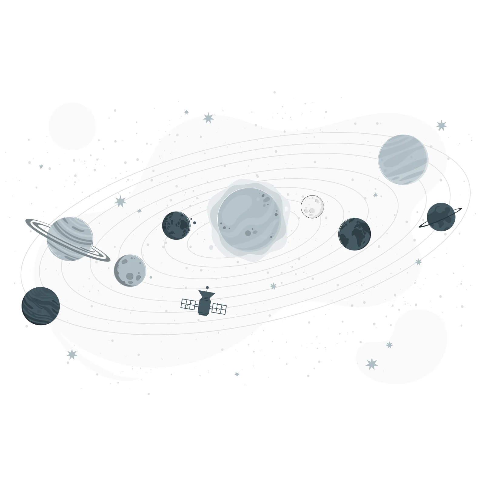

**A simple way for artists to show clients where their commission is.**

 

&nbsp;

## Need to track your commissions?

Yeah. That’s basically why this exists.

You get one link to share. Clients open it anytime and see your queue, progress, prices, TOS, gallery — whatever you put up. You keep working from your board; they stop pinging you for status checks.

## What’s in it

<table>
  <tr>
    <td width="33%" align="center" valign="top">
       
      <strong>Live progress</strong> 
      Move a piece forward, clients see the % update depending on the workflow you set up.
    </td>
    <td width="33%" align="center" valign="top">
       
      <strong>Queue order</strong> 
      They can see who’s in progress and who’s next. Waitlist is separate so it doesn’t get confusing.
    </td>
    <td width="33%" align="center" valign="top">
       
      <strong>Your own link</strong> 
      Pick a username once and share something like <code>/u/yourname</code>. Way nicer than a long random URL.
    </td>
  </tr>
</table>

 

| You | Them |
| --- | --- |
| Edit availability, gallery, prices, TOS, socials in the Hub | Open one page, no account needed |
| Drag commissions around on your boards | See queue number, progress, and est. finish (or — if you’re still figuring it out) |
| Track earnings | Find how to contact you |
| Set workflow stages so progress fills in automatically | Don’t see client emails in the queue |

## Getting started

1. **[Sign up](https://jupitercomms.vercel.app/signup)**
2. Fill in your Hub a bit — gallery, prices, TOS, availability
3. Claim a username in Settings and copy your link
4. Add commissions and drag them through the queue as you go

## Behind the scenes

Built with Next.js + Supabase.

Inspired by [Carrd](https://carrd.co) — that one-page simplicity — but made for commissions. Hub, queue, and client link live together so you’re not juggling a bunch of apps or sites, and clients aren’t getting bounced around just to check status.

Art by [Storyset](https://storyset.com/cute).

**Orbit by Jupiter** — do commissions without the status spam.

[jupitercomms.vercel.app](https://jupitercomms.vercel.app)

